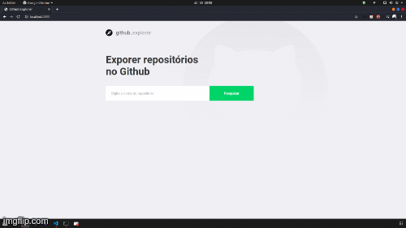

<h1 align="center">
  
</h1>

<h1 align="center">
  
</h1>

<p align="center">
  <a href="#bookmark-about">About</a>
  &nbsp;&nbsp;&nbsp;|&nbsp;&nbsp;&nbsp;
  <a href="#rocket-technologies">Technologies</a>
  &nbsp;&nbsp;&nbsp;|&nbsp;&nbsp;&nbsp;
  <a href="#package-how-to-run">How to run</a>
  &nbsp;&nbsp;&nbsp;|&nbsp;&nbsp;&nbsp;
  <a href="#memo-license">License</a>
</p>

## :bookmark: About

Created web application using **ReactJS** with goal to practice every learned content in the module of **ReactJS** of **Bootcamp GoStack**. This project it's possible to find the projects in the **GitHub** and display your issues. See below all learned content:
- Structure and Standards
  - Create React Project
  - EditorConfig
  - ESLint
  - Prettier
- Create application
  - Create routes
  - Using Styled Components
  - Style Dashboard page
  - Connect api of github
  - Validate errors
  - Save repositories in localstorage
  - Navigate between routes
  - Style Repository Details page
  - List issues of repository using api github

## :rocket: Technologies
 - [ReactJS](https://reactjs.org/)
 - [Localstorage](https://developer.mozilla.org/pt-BR/docs/Web/API/Window/Window.localStorage)
 - [Styled Components](https://styled-components.com/)
 - [Axios](https://github.com/axios/axios)

## :package: How to run
```bash
  #Clone the project
  git clone https://github.com/rodolfoO28/week-3-first-react-project.git first-project-reactjs

  #Enter inside folder
  cd first-project-reactjs

  #Install dependencies using npm or yarn
  npm install
  #or
  yarn install

  #Start the project using npm or yarn
  npm start
  #or
  yarn start

```

## :memo: License

This project is licensed under the terms of the [MIT license](/LICENSE).
